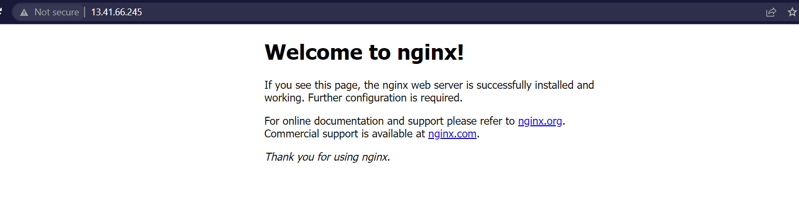
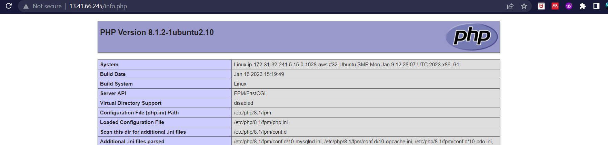
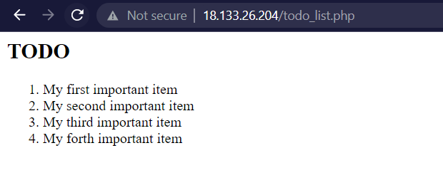

# **PROJECT 2: LEMP IMPLEMENTATION**

This project is about developing a PHP website using Ngnix as web server and MySQL as database management system.

1. Connecting to EC2 Instance of t2.nano family with Ubuntu Server 22.04 LTS (HVM) via SSH key 

2. Ngnix web server installation 
    
    

    

3. Installing MySQL and running security script,

    Login to **root** user with password

    

4. Installing and configuring PHP to work with Ngnix

    

    

    

    

5. Retrieving data from MySQL database with PHP

    - creating database with MySQL and todo_list file

         

    -creating todo_list.php script to query content 
        
    

