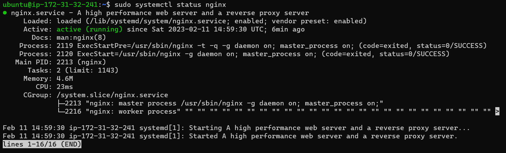
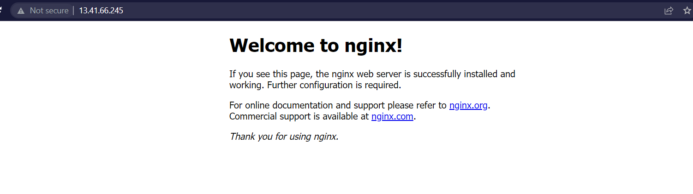
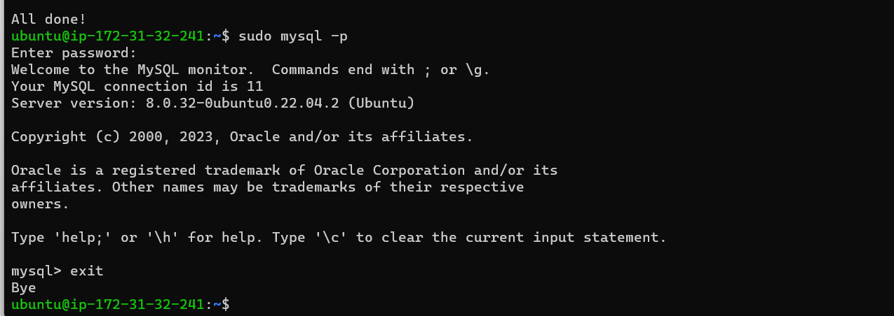
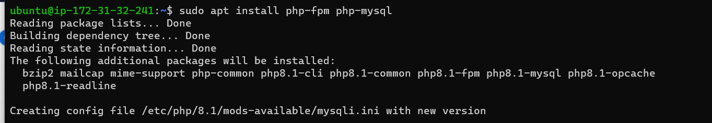
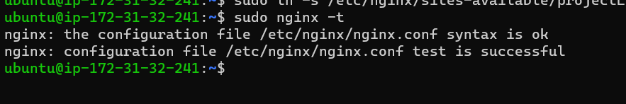
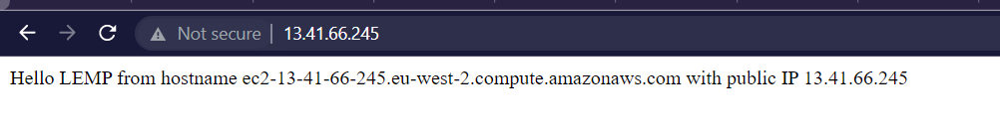
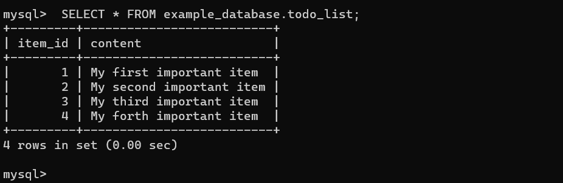
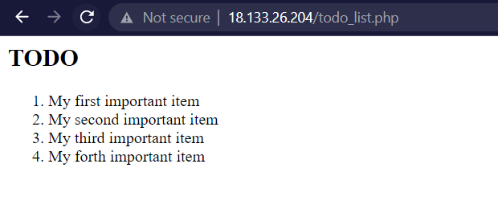

# **PROJECT 2: LEMP IMPLEMENTATION**

This project is about developing a PHP website using Ngnix as web server and MySQL as database management system.

1. **Connecting to EC2 Instance of t2.nano family with Ubuntu Server 22.04 LTS (HVM) via SSH key** 

2. **Ngnix web server installation**
    
    

    

3. **Installing MySQL and running security script**

    Login to **root** user with password

    

4. **Installing and configuring PHP to work with Ngnix**

    

    

    

    

5. **Retrieving data from MySQL database with PHP**

    - creating database with MySQL and todo_list file

        At this step I was getting an error when I tried to set a password for user "example_user".

        The error message: ERROR 1819 (HY000): Your password does not satisfy the current policy requirements

        So I ran `SHOW VARIABLES LIKE 'validate_password%';` to check the password validation parameters and `SET GLOBAL validate_password.length = 6;` to change the password lenght as suggested on here [link](https://stackoverflow.com/questions/43094726/your-password-does-not-satisfy-the-current-policy-requirements)

        

        And success!

        

    -creating todo_list.php script to query content 
        
    

