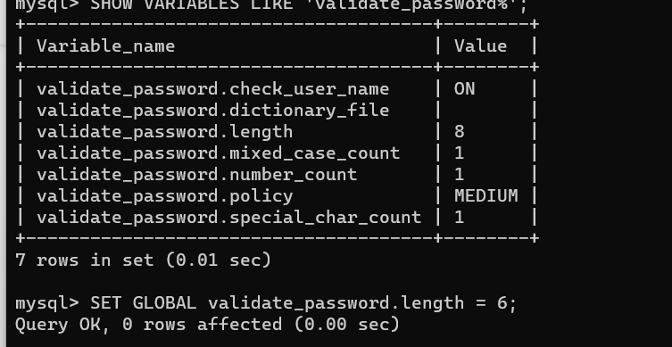

# **PROJECT 2: LEMP IMPLEMENTATION**


This project is about developing a PHP website using Ngnix as web server and MySQL as database management system.


### Create an EC2 instance of t2.micro family with Ubuntu Server 20.04 LTS (HVM) in AWS
   

links for help: 
   

[Install OpenSSH for Windows](https://learn.microsoft.com/en-us/windows-server/administration/openssh/openssh_install_firstuse?tabs=powershell)
   
   
[Key-based authentication in OpenSSH for Windows](https://learn.microsoft.com/en-us/windows-server/administration/openssh/openssh_keymanagement)


[Using EC2 as your virtual server](https://www.youtube.com/watch?v=xxKuB9kJoYM&list=PLtPuNR8I4TvkwU7Zu0l0G_uwtSUXLckvh&index=7)   
   
   
[connecting to EC2 instance in AWS](https://www.youtube.com/watch?v=TxT6PNJts-s&list=PLtPuNR8I4TvkwU7Zu0l0G_uwtSUXLckvh&index=8)


1. Open terminal and move into the folder where you saved your public key, use `cd <folder>`


    **NOTE** to ensure that your key is not publicly viewable run `chmod 400 PBL_key_pair.pem`, otherwise you could get a "Bad permissions" error


2. Start your EC2 instance in AWS and SSH into it(=connect) with public key and its Public DNS in you terminal


    use: `ssh -i <private-key-name>.pem ubuntu@<Public-IP-address>` 


### Install Ngnix web server

1. Update **apt** package manager in Ubuntu with `sudo apt update`


2. install Ngnix package with `sudo apt install ngnix` and confirm with `y` to install

    
3. Verify that Ngnix is installed with `sudo systemctl status nginx`
   

    **Note** In order to access you Ngnix web server you need to configure an open connection through port 80 in AWS- add it to the inboud rules in the network settings (security groups)


4. Test that the web server responds to requests for the Inetrnet


    Try to access it with Google Chrome (or any other browser) with the URL  `http://<Public-IP-Address>:80` replacing `<Public-IP-Address>` with your instance IP address or you can use its DNS name instead

    If you see this it means that Ngnix is correctly installed and accessible through your Firewall

    


### Install MySQL and run security script**


1. Install MySQL with `sudo apt install mysql-server`

    confirm installation with `y`


2.  Login to MySQL with `sudo mysql`

    
3.  Set a password for root user using mysql_native_password  default authentication method

    `ALTER USER 'root'@'localhost' IDENTIFIED WITH mysql_native_password BY '<password>';`

    
4. exit MySQL: `mysql> exit`


5. Run security script with  `sudo mysql_secure_installation` to set password for MySQL


    **Note** after this command you will be asked if you want to enable the VALIDATE PASSWORD PLUGIN, to validate a password for the database root user. If enabled, MySQL will reject passwords with an error if they don't meet the specified criteria. 
    
    Validation can be stopped without risk, but you should always use secure, one-of-a-kind passwords for database logins. Also note that the database root user is not the same as the system root, in fact the database root is an administrative user that has full privileges over the system root.


    If you choose 'yes' keep in mind that you need to choose the strength for your password based on the following

    ```
    # There are three levels of password validation policy:

    LOW    Length >= 8
    MEDIUM Length >= 8, numeric, mixed case, and special characters
    STRONG Length >= 8, numeric, mixed case, special characters and dictionary              file

    Please enter 0 = LOW, 1 = MEDIUM and 2 = STRONG: 1
    ```


    **Note** In level 2 validation, you should choose a complex password with a mix of upper and lowercase letters, special characters and numbers otherwise you will get an error

    
6. After validating password (or not) press `y` for all other rquestions


7. Test your new password with `$ sudo mysql -p`

 
    **Note** make sure you have mysql_native_password configured for PHP applications as MySQL PHP library mysqlnd doesn’t support caching_sha2_authentication, the default authentication method for MySQL 8. 


### Install PHP packages and configure Ngnix to use PHP 

1. run `sudo apt install php-fpm php-mysql` to install packagaes php-fpm and php-mysql which allow Nginx to work with PHP nad MySQL respsectively

    press `y` to confirm installation


2. Set up a configuration inside /var/www for your server's domain, here we call the domain projectlemp.

     `sudo mkdir /var/www/projectlemp` to to serve documents from your domain


3. Give ownwership of your domain's directory to systemm user with ` sudo chown -R $USER:$USER /var/www/projectlemp` 


4. Run `sudo nano /etc/ngnix/sites-available/projectlemp` to open a new configuration in Ngnix "sites-available" directory. Paste the following into the file, then save and exit the editor.

    ```
    #/etc/nginx/sites-available/projectLEMP

    server {
    listen 80;
    server_name projectLEMP www.projectLEMP;
    root /var/www/projectLEMP;

    index index.html index.htm index.php;

    location / {
        try_files $uri $uri/ =404;
    }

    location ~ \.php$ {
        include snippets/fastcgi-php.conf;
        fastcgi_pass unix:/var/run/php/php8.1-fpm.sock;
     }

    location ~ /\.ht {
        deny all;
    }
    }

    ```


5. Activate your configuration by linking to the config file from Nginx’s sites-enabled directory

     `sudo ln -s /etc/nginx/sites-available/projectlemp/etc/nginx/sites-enabled/`


6. test your configuration for syntax errors with `sudo nginx -t`

    if you see this then you have no errors

    ```
    nginx: the configuration file /etc/nginx/nginx.conf syntax is ok
    nginx: configuration file /etc/nginx/nginx.conf test is successful
    ```


6. Disable Ngnix host that is set to listen on port 80 by default

    `sudo unlink /etc/nginx/sites-enabled/default`


7. Reload Ngnix to apply chnages with `sudo systemctl reload nginx`
    

8. Create and index.html file inside your domain directory /var/www/projectlemp to test that your server works perfectly, and inside the file write the following


    ```
    sudo echo 'Hello LEMP from hostname' $(curl -s http://169.254.169.254/latest/meta-data/public-hostname) 'with public IP' $(curl -s http://169.254.169.254/latest/meta-data/public-ipv4) > /var/www/projectLEMP/index.html
    ```


9. Open your website in your browser: `http://<Public-IP-Address or Public-DNS-Name>:80` and if you see the message from the **echo** command in the index.html file then Ngnix is working fine


### Test PHP with Ngnix


1. create a PHP test script to ensure that Ngnix can handle .php files

    use `sudo nano /var/www/projectlemp/info.php` to create a info.php file inside your website's domain directory and paste the following in it

    ```
    <?php
    phpinfo();
    ```


2. Save and exit the editor. Reload the `http://<server_domain or IP address>:80` page in your browser and you will see a web page containing detailed information about your server

    


3. The run `sudo rm /var/www/projectlemp/info.php` to remove the file as it contains sensitive information


### Retrieve data from MySQL database with PHP


Create a test database (DB) with simple "To do list" and configure access to it, so the Nginx website would be able to query data from the DB and display it.


At the time of writing, the native MySQL PHP library `mysqlnd` does not support `caching sha2 authentication`, MySQL 8's default authentication method. To connect to the MySQL database using PHP, we'll need to create a new user using the `mysql_native_password` authentication method.


1. login to MySQl with `sudo mysql`


2. create a new database and new user with full privileges on the database

   - `mysql> CREATE DATABASE 'example_database';`

        You can name the database as you like, here we call it example_database

    - `mysql>  CREATE USER 'example_user'@'%' IDENTIFIED WITH mysql_native_password BY '<password>';`

        **Note** here you should choose a strong password for the database user

        Comment: at this step I was getting an error when I tried to set a password for user "example_user"

        The error message: ERROR 1819 (HY000): Your password does not satisfy the current policy requirements

        So I ran `SHOW VARIABLES LIKE 'validate_password%';` to check the password validation parameters and `SET GLOBAL validate_password.length = 6;` to change the password lenght as suggested on here [link](https://stackoverflow.com/questions/43094726/your-password-does-not-satisfy-the-current-policy-requirements)

        


3. exit Mysql `mysql> exit`


4. Test that your changes were effective

    - use `mysql -u example_user -p` and enter password 

    - use `mysql> SHOW DATABASES:` to check that new use has acess to the new database and you will see this

        ```
        Output
        +--------------------+
        | Database           |
        +--------------------+
        | example_database   |
        | information_schema |
        +--------------------+
        2 rows in set (0.000 sec)
        ```


5. create a test table in mysql, we will call it **todo_list**

    Inside mysql run

    ```
    CREATE TABLE example_database.todo_list (
    item_id INT AUTO_INCREMENT,
    content VARCHAR(255),
    PRIMARY KEY(item_id)
    );
    ```


6. Insert a few values using this command `mysql> INSERT INTO example_database.todo_list (content) VALUES ("My first important item");` as many times as you need and USING different VALUES


7. test your table with `mysql>  SELECT * FROM example_database.todo_list;` and you will sall the VALUES you entered in a table


    ```
    Output
    +---------+--------------------------+
    | item_id | content                  |
    +---------+--------------------------+
    |       1 | My first important item  |
    |       2 | My second important item |
    |       3 | My third important item  |
    |       4 | and this one more thing  |
    +---------+--------------------------+
    4 rows in set (0.000 sec)
    ```


8. exit MySQL with `exit`


9. create a PHP test script that can listen to MySQL and display the contents from teh todo_list table


    use `nano /var/www/projectLEMP/todo_list.php` and paste into the page the following

    ```
    <?php
    $user = "example_user";
    $password = "password";
    $database = "example_database";
    $table = "todo_list";

    try {
    $db = new PDO("mysql:host=localhost;dbname=$database", $user, $password);
    echo "<h2>TODO</h2><ol>";
    foreach($db->query("SELECT content FROM $table") as $row) {
        echo "<li>" . $row['content'] . "</li>";
    }
    echo "</ol>";
    } catch (PDOException $e) {
        print "Error!: " . $e->getMessage() . "<br/>";
        die();
    }
    ```


10. Save and close the editor, now test your script. Go to your browser and open yur website with `http://<Public_domain_or_IP>/todo_list.php`

    If you see this then all is good!
    
    
    


